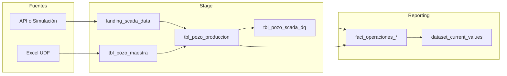

# Auditoría multi-agente: BP010 Data Pipelines

Documento consolidado desde la perspectiva de **devops-engineer**, **postgres-data-expert**, **python-dev** y **data-ml-architect**. Referencia: [GUIA_REPLICACION_AUDITORIA_IA.md](GUIA_REPLICACION_AUDITORIA_IA.md).

---

## 1. Arquitectura

### 1.1 Dual-Lambda (producción)

El sistema en producción no es monolítico; son dos servicios serverless desacoplados:

- **Servicio de Ingesta (Stage)**: `docker/rds-stage-etl-project/etl_app/lambda_handler.py`. Ingesta API + transformación pivot. Flujo: Trigger -> `V1__raw_to_stage` -> `V1__stage_to_stage`.
- **Servicio de Reportes (Reporting)**: `docker/rds-reporting-etl-project/etl_app/lambda_handler.py`. KPIs y snapshot. Flujo: Trigger -> `V1__stage_to_reporting` -> `V3__actualizar_current_values`.

### 1.2 Flujo local (auditoría)

En el repo de auditoría el flujo se orquesta con notebooks y `MASTER_PIPELINE_RUNNER.py`: DDL (init_schemas) -> UDF -> ingesta real o simulación -> pivot (0_3) -> DQ (sp_execute_dq_validation) -> reporting (sp_load_to_reporting) -> snapshot (1_2_actualizar_current_values).

### 1.3 Flujo de datos (diagrama)

---

## 2. Lineage resumido

| Rama | Origen | Destino principal | Proceso |
|------|--------|-------------------|---------|
| **Estática** | Formato1_Excel_Reservas.xlsx | stage.tbl_pozo_maestra | 0_1_udf_to_stage |
| **Dinámica** | API / simulación | stage.landing_scada_data | ingest_real_telemetry o simulate_landing_data |
| **Pivot** | landing_scada_data + tbl_pozo_maestra | stage.tbl_pozo_produccion | V1__stage_to_stage (notebook 0_3) |
| **DQ** | tbl_pozo_produccion + referencial.tbl_dq_rules | stage.tbl_pozo_scada_dq | sp_execute_dq_validation (V5) |
| **Reporting** | stage + referencial | fact_operaciones_* y dataset_current_values | sp_load_to_reporting, V3__actualizar_current_values |

---

## 3. Checklist por agente (guía vs correcciones aplicadas)

### Postgres (postgres-data-expert)

| Ítem guía | Estado |
|-----------|--------|
| Esquemas V3/V4 en init_schemas | OK (V4 stage, V3 referencial/reporting) |
| tbl_limites_pozo alineada con DDL y poblada | **Corregido**: V4__referencial_limits_patch reescrito con pozo_id, target_value, baseline_value, min/max_warning, min/max_critical; añadido a init_schemas tras seed. |
| DQ engine (V5) ejecutable | OK (sp_execute_dq_validation en secuencia) |

### Python (python-dev)

| Ítem guía | Estado |
|-----------|--------|
| Credenciales desde env (no hardcodeadas) | OK (notebooks parcheados; runner usa getenv) |
| Runner portable | **Corregido**: PYTHON_EXE = sys.executable; JUPYTER_EXE desde JUPYTER_EXE o shutil.which("jupyter"); fallback Windows opcional. |
| Dependencias reproducibles | **Corregido**: requirements.txt con rangos (pandas>=2.0,<3, sqlalchemy>=2.0, etc.). |

### DevOps (devops-engineer)

| Ítem guía | Estado |
|-----------|--------|
| Docker y red aislada | OK (docker-compose con bp010-audit-net) |
| Prerrequisitos documentados | **Añadido**: ENV_AUDITORIA.md (Prerrequisitos) y RUNBOOK_AUDITORIA.md con orden de ejecución y dependencia de bp010-audit-db. |
| Contenedor up antes de init_schemas/runner | Documentado (docker compose up -d; pg_isready opcional). |

### Data-ML (data-ml-architect)

| Ítem guía | Estado |
|-----------|--------|
| Aislamiento (repo distinto al original) | OK (auditoría en BP010-data-pipelines-auditoria) |
| Encoding SQL y type casting | Documentado en ENV_AUDITORIA; runner usa '...'::DATE en CALLs. |
| Verificación en dataset_current_values | Documentado en guía y runbook (Adminer, consultas). |

---

## 4. Hallazgos conocidos (guía)

- **Ingesta horaria**: Para ver datos en `reporting.fact_operaciones_horarias` hay que invocar `sp_load_to_reporting` con `p_procesar_horario = TRUE` (el runner ya lo hace con TRUE).
- **DQ engine**: En auditoría está integrado (V5__dq_engine_orchestrator; sp_execute_dq_validation en MASTER_PIPELINE_RUNNER). En el repo original/local sin este orquestador el dashboard podía mostrar siempre PASS erróneamente.
- **Inconsistencia semántica y tipos**: En reporting, `rpm_motor` mapeado a `freq_vsd_hz` y limitación por `DECIMAL(5,2)` (guía sección 6).
- **Capa Universal**: `ipr_resultados` y `arps_resultados_declinacion` vacías; requieren modelos externos no incluidos en este repo.

---

## 5. Archivos modificados en esta auditoría

- `src/sql/schema/V4__referencial_limits_patch.sql`: INSERT alineado con V3 referencial (pozo_id, target_value, baseline_value, min/max_warning, min/max_critical).
- `init_schemas.py`: Inclusión de V4__referencial_limits_patch.sql tras V3__referencial_seed_data.
- `MASTER_PIPELINE_RUNNER.py`: Ejecutables portables (sys.executable, JUPYTER_EXE / which); rutas con Path y cwd.
- `requirements.txt`: Versiones con rangos compatibles.
- `ENV_AUDITORIA.md`: Prerrequisitos Docker y dependencia de bp010-audit-db.
- `RUNBOOK_AUDITORIA.md`: Nuevo; orden de ejecución y verificación.
- `AUDITORIA_MULTIAGENTE.md`: Este documento.
